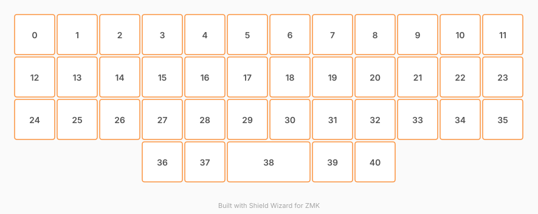

Tool/WebApp used for KLE/Plate/PCB/Matrix : <https://editor.keyboard-tools.xyz/>

# ZMK Configuration for Game Planck

*Generated by Shield Wizard for ZMK*



Download compiled firmware from the Actions tab. <https://zmk.dev/docs/user-setup#installing-the-firmware>

Edit your keymap <https://zmk.dev/docs/keymaps>.
User keymap is located at [`config/game_planck.keymap`](config/game_planck.keymap).

-----

<details>
<summary>
Shield Wizard Debug Information
</summary>

In case of broken configuration, here is the Shield Wizard internal data used to generate this configuration:

Commit: 7ee29dba13bb6e3b8a7524c1aa57934684b06785

```json
{"name":"Game Planck","shield":"game_planck","dongle":false,"modules":[],"layout":[{"id":"01KY24FPQQY4MYBTWPNGNSJVVR","part":0,"row":0,"col":0,"w":1,"h":1,"x":0,"y":0,"r":0,"rx":0,"ry":0},{"id":"01KY24FPQQRKB1PBZDTB2P034P","part":0,"row":0,"col":1,"w":1,"h":1,"x":1,"y":0,"r":0,"rx":0,"ry":0},{"id":"01KY24FPQQD5FVSEBWM26ZAMYQ","part":0,"row":0,"col":2,"w":1,"h":1,"x":2,"y":0,"r":0,"rx":0,"ry":0},{"id":"01KY24FPQQQ97PDPH10853DF00","part":0,"row":0,"col":3,"w":1,"h":1,"x":3,"y":0,"r":0,"rx":0,"ry":0},{"id":"01KY24FPQQJ6CWE7NZPBR7C6KD","part":0,"row":0,"col":4,"w":1,"h":1,"x":4,"y":0,"r":0,"rx":0,"ry":0},{"id":"01KY24FPQQWZ1YGBB4BDA86NM2","part":0,"row":0,"col":5,"w":1,"h":1,"x":5,"y":0,"r":0,"rx":0,"ry":0},{"id":"01KY24FPQQYVA0B3M4H8AS3WRK","part":0,"row":0,"col":6,"w":1,"h":1,"x":6,"y":0,"r":0,"rx":0,"ry":0},{"id":"01KY24FPQQZY4KY3471RQESBNP","part":0,"row":0,"col":7,"w":1,"h":1,"x":7,"y":0,"r":0,"rx":0,"ry":0},{"id":"01KY24FPQQF5QEW003KA139A01","part":0,"row":0,"col":8,"w":1,"h":1,"x":8,"y":0,"r":0,"rx":0,"ry":0},{"id":"01KY24FPQQRSDFDS1CJ00NSYMG","part":0,"row":0,"col":9,"w":1,"h":1,"x":9,"y":0,"r":0,"rx":0,"ry":0},{"id":"01KY24FPQQV463668PF9X9ESDV","part":0,"row":0,"col":10,"w":1,"h":1,"x":10,"y":0,"r":0,"rx":0,"ry":0},{"id":"01KY24FPQQZ1QJZGADMV5MD4ZM","part":0,"row":0,"col":11,"w":1,"h":1,"x":11,"y":0,"r":0,"rx":0,"ry":0},{"id":"01KY24FPQQD8A27PKWQQP00FKN","part":0,"row":1,"col":0,"w":1,"h":1,"x":0,"y":1,"r":0,"rx":0,"ry":0},{"id":"01KY24FPQQBT30J4BCXMXJQTF0","part":0,"row":1,"col":1,"w":1,"h":1,"x":1,"y":1,"r":0,"rx":0,"ry":0},{"id":"01KY24FPQQKGA1EB850GFQ8AGP","part":0,"row":1,"col":2,"w":1,"h":1,"x":2,"y":1,"r":0,"rx":0,"ry":0},{"id":"01KY24FPQQ2MSKG5VHSWCNZV1P","part":0,"row":1,"col":3,"w":1,"h":1,"x":3,"y":1,"r":0,"rx":0,"ry":0},{"id":"01KY24FPQQKWWHKQJABPKHEQ4B","part":0,"row":1,"col":4,"w":1,"h":1,"x":4,"y":1,"r":0,"rx":0,"ry":0},{"id":"01KY24FPQQEVSVT1Y1BB7A67Q6","part":0,"row":1,"col":5,"w":1,"h":1,"x":5,"y":1,"r":0,"rx":0,"ry":0},{"id":"01KY24FPQQ6PWE5QS5MT53Y1AR","part":0,"row":1,"col":6,"w":1,"h":1,"x":6,"y":1,"r":0,"rx":0,"ry":0},{"id":"01KY24FPQQV0QTV0F07WKV8EA4","part":0,"row":1,"col":7,"w":1,"h":1,"x":7,"y":1,"r":0,"rx":0,"ry":0},{"id":"01KY24FPQQKM885XQ98FWDCTP6","part":0,"row":1,"col":8,"w":1,"h":1,"x":8,"y":1,"r":0,"rx":0,"ry":0},{"id":"01KY24FPQQA9BRRY1B3XGQXGX5","part":0,"row":1,"col":9,"w":1,"h":1,"x":9,"y":1,"r":0,"rx":0,"ry":0},{"id":"01KY24FPQQHNW0K0C2K5E1E2JA","part":0,"row":1,"col":10,"w":1,"h":1,"x":10,"y":1,"r":0,"rx":0,"ry":0},{"id":"01KY24FPQQBAPQGE9WKZKVWFWB","part":0,"row":1,"col":11,"w":1,"h":1,"x":11,"y":1,"r":0,"rx":0,"ry":0},{"id":"01KY24FPQQX6NHY33FBTVQB7XQ","part":0,"row":2,"col":0,"w":1,"h":1,"x":0,"y":2,"r":0,"rx":0,"ry":0},{"id":"01KY24FPQQ00VVX1CNPGHMMNN9","part":0,"row":2,"col":1,"w":1,"h":1,"x":1,"y":2,"r":0,"rx":0,"ry":0},{"id":"01KY24FPQQRC48RMNDGQGFHJRB","part":0,"row":2,"col":2,"w":1,"h":1,"x":2,"y":2,"r":0,"rx":0,"ry":0},{"id":"01KY24FPQQV10CE27FAFJFX7BP","part":0,"row":2,"col":3,"w":1,"h":1,"x":3,"y":2,"r":0,"rx":0,"ry":0},{"id":"01KY24FPQQT8RH0HB191PN94V1","part":0,"row":2,"col":4,"w":1,"h":1,"x":4,"y":2,"r":0,"rx":0,"ry":0},{"id":"01KY24FPQQ68WGT1VB11D586EG","part":0,"row":2,"col":5,"w":1,"h":1,"x":5,"y":2,"r":0,"rx":0,"ry":0},{"id":"01KY24FPQQBD2X6NMR7HZK3J3Y","part":0,"row":2,"col":6,"w":1,"h":1,"x":6,"y":2,"r":0,"rx":0,"ry":0},{"id":"01KY24FPQQF2DVYGVM46BG0DSV","part":0,"row":2,"col":7,"w":1,"h":1,"x":7,"y":2,"r":0,"rx":0,"ry":0},{"id":"01KY24FPQQHGSAQJ4DXW2CH490","part":0,"row":2,"col":8,"w":1,"h":1,"x":8,"y":2,"r":0,"rx":0,"ry":0},{"id":"01KY24FPQRQBBAT91EGTA8DM3J","part":0,"row":2,"col":9,"w":1,"h":1,"x":9,"y":2,"r":0,"rx":0,"ry":0},{"id":"01KY24FPQR5277MJH7K6HAXEHF","part":0,"row":2,"col":10,"w":1,"h":1,"x":10,"y":2,"r":0,"rx":0,"ry":0},{"id":"01KY24FPQRXXQW4Q1MWCE98V2T","part":0,"row":2,"col":11,"w":1,"h":1,"x":11,"y":2,"r":0,"rx":0,"ry":0},{"id":"01KY24FPQRCHSN1XP84C5P3XQR","part":0,"row":3,"col":0,"w":1,"h":1,"x":0,"y":3,"r":0,"rx":0,"ry":0},{"id":"01KY24FPQRRPZ8ART5N1XAP7FK","part":0,"row":3,"col":1,"w":1,"h":1,"x":1,"y":3,"r":0,"rx":0,"ry":0},{"id":"01KY24FPQR21355Z5V95XEQFHR","part":0,"row":3,"col":2,"w":1,"h":1,"x":2,"y":3,"r":0,"rx":0,"ry":0},{"id":"01KY24FPQR9530B7EQ1RJ8FVWK","part":0,"row":3,"col":3,"w":1,"h":1,"x":3,"y":3,"r":0,"rx":0,"ry":0},{"id":"01KY24FPQR5KCTDY3TEQ9HZS21","part":0,"row":3,"col":4,"w":1,"h":1,"x":4,"y":3,"r":0,"rx":0,"ry":0},{"id":"01KY24FPQRTR81XNA7BK024WNC","part":0,"row":3,"col":5,"w":1,"h":1,"x":5,"y":3,"r":0,"rx":0,"ry":0},{"id":"01KY24FPQRX99P5303VD68TQNY","part":0,"row":3,"col":6,"w":1,"h":1,"x":6,"y":3,"r":0,"rx":0,"ry":0},{"id":"01KY24FPQR38QGP7ZD39FY9H97","part":0,"row":3,"col":7,"w":1,"h":1,"x":7,"y":3,"r":0,"rx":0,"ry":0},{"id":"01KY24FPQRF0V4RNW12BS4EZFN","part":0,"row":3,"col":8,"w":1,"h":1,"x":8,"y":3,"r":0,"rx":0,"ry":0},{"id":"01KY24FPQR26BC19X98T7QPAFE","part":0,"row":3,"col":9,"w":1,"h":1,"x":9,"y":3,"r":0,"rx":0,"ry":0},{"id":"01KY24FPQR4MNHBEAKBYM6SM74","part":0,"row":3,"col":10,"w":1,"h":1,"x":10,"y":3,"r":0,"rx":0,"ry":0},{"id":"01KY24FPQRRJ07PQ83BZ5VDRW2","part":0,"row":3,"col":11,"w":1,"h":1,"x":11,"y":3,"r":0,"rx":0,"ry":0},{"id":"01KY24FPQRE214STD49HK97S0M","part":0,"row":4,"col":3,"w":1,"h":1,"x":3,"y":4,"r":0,"rx":0,"ry":0},{"id":"01KY24FPQRQ824TJV5AHPQTDQ7","part":0,"row":4,"col":4,"w":1,"h":1,"x":4,"y":4,"r":0,"rx":0,"ry":0},{"id":"01KY24FPQRHEH38YGVH6G29SP1","part":0,"row":4,"col":5,"w":2,"h":1,"x":5,"y":4,"r":0,"rx":0,"ry":0},{"id":"01KY24FPQRZ25QJ1G3NTD4X4T3","part":0,"row":4,"col":7,"w":1,"h":1,"x":7,"y":4,"r":0,"rx":0,"ry":0},{"id":"01KY24FPQR61AZ7B7Q7EQ9ANSA","part":0,"row":4,"col":8,"w":1,"h":1,"x":8,"y":4,"r":0,"rx":0,"ry":0}],"parts":[{"name":"firmavocado","controller":"nice_nano_v2","pins":{"d0":{"usage":"kscan","kscan":"01KY20K8YDP74ZD9085HC5MDFY","role":"input"},"d2":{"usage":"kscan","kscan":"01KY20K8YDP74ZD9085HC5MDFY","role":"input"},"d3":{"usage":"kscan","kscan":"01KY20K8YDP74ZD9085HC5MDFY","role":"input"},"d1":{"usage":"kscan","kscan":"01KY20K8YDP74ZD9085HC5MDFY","role":"input"},"d5":{"usage":"kscan","kscan":"01KY20K8YDP74ZD9085HC5MDFY","role":"output"},"d6":{"usage":"kscan","kscan":"01KY20K8YDP74ZD9085HC5MDFY","role":"output"},"d7":{"usage":"kscan","kscan":"01KY20K8YDP74ZD9085HC5MDFY","role":"output"},"d8":{"usage":"kscan","kscan":"01KY20K8YDP74ZD9085HC5MDFY","role":"output"},"d9":{"usage":"kscan","kscan":"01KY20K8YDP74ZD9085HC5MDFY","role":"output"},"d21":{"usage":"kscan","kscan":"01KY20K8YDP74ZD9085HC5MDFY","role":"output"},"d20":{"usage":"kscan","kscan":"01KY20K8YDP74ZD9085HC5MDFY","role":"output"},"d19":{"usage":"kscan","kscan":"01KY20K8YDP74ZD9085HC5MDFY","role":"output"},"d18":{"usage":"kscan","kscan":"01KY20K8YDP74ZD9085HC5MDFY","role":"output"},"d15":{"usage":"kscan","kscan":"01KY20K8YDP74ZD9085HC5MDFY","role":"output"},"d14":{"usage":"kscan","kscan":"01KY20K8YDP74ZD9085HC5MDFY","role":"output"},"d16":{"usage":"kscan","kscan":"01KY20K8YDP74ZD9085HC5MDFY","role":"output"},"d4":{"usage":"kscan","kscan":"01KY20K8YDP74ZD9085HC5MDFY","role":"input"}},"kscans":[{"kind":"matrix","id":"01KY20K8YDP74ZD9085HC5MDFY","diodes":true}],"keys":{"01KY20GS71XV6YX4MXZFXPV18M":{"input":"d1"},"01KY20GS727CSH1PJ583RJ106S":{"input":"d0"},"01KY20GS721QBHPP8SEEXHXN3W":{"input":"d2"},"01KY20GS723T06YBYSRZZYWA9J":{"input":"d2","output":"d5"},"01KY20GS72W0W6PCH806CXGWEC":{"input":"d2","output":"d6"},"01KY20GS7288EKHC2MAJDWDJTB":{"input":"d2","output":"d7"},"01KY20GS729DKHDVMG9TMCY74Z":{"input":"d2","output":"d8"},"01KY20GS72JS7BCNY1WYAJKV4V":{"input":"d2","output":"d9"},"01KY20GS72D88Q4FTBQSJ37YJH":{"input":"d2","output":"d21"},"01KY20GS722KVFRX7W58S7PRY6":{"input":"d2","output":"d20"},"01KY20GS72HR327KWPGQM3TPC5":{"input":"d2","output":"d19"},"01KY20GS72FW7W02T4YJWVY0CD":{"input":"d2","output":"d18"},"01KY20GS728S6EPR2WM1XT7C7E":{"input":"d2","output":"d15"},"01KY20GS725YF4ZG897ZNARPMJ":{"input":"d2","output":"d14"},"01KY20GS72XQ77E4R8PS4D75GS":{"input":"d0","output":"d14"},"01KY20GS72501EWVWN022XSWVS":{"input":"d0","output":"d15"},"01KY20GS727NV7E8Z62Z58G52X":{"input":"d0","output":"d18"},"01KY20GS724K9S6TDYZ8GG91PE":{"input":"d0","output":"d19"},"01KY20GS72QNW407T3WE0G6BKJ":{"input":"d0","output":"d20"},"01KY20GS72KV87WY3SKPWR246D":{"input":"d0","output":"d21"},"01KY20GS72F3JGT3DV4FF0H3D5":{"input":"d0","output":"d9"},"01KY20GS7240FDZT8V8J2TW7AC":{"input":"d0","output":"d8"},"01KY20GS722656Y305W1DENK0C":{"input":"d0","output":"d7"},"01KY20GS72S0RQD1H3A6NGHNYD":{"input":"d0","output":"d6"},"01KY20GS729PA2GT31A3AAH5XB":{"input":"d0","output":"d5"},"01KY20GS72EBJYDKZ9650YYZ9A":{"input":"d1","output":"d5"},"01KY20GS72PXWX1S7JA8DBYXB0":{"input":"d1","output":"d6"},"01KY20GS72YKZMAQA1QGEHG2QE":{"input":"d1","output":"d7"},"01KY20GS72G73C5TPRAWDTH96A":{"input":"d1","output":"d8"},"01KY20GS72NWPA0AER584CH68P":{"input":"d1","output":"d9"},"01KY20GS72E1YYQVZKRD8GWZ5H":{"input":"d1","output":"d21"},"01KY20GS72P33BXDET642JDGZ6":{"input":"d1","output":"d20"},"01KY20GS72KF58H1FKX0TD7CBG":{"input":"d1","output":"d19"},"01KY20GS72M9K3RZE1PCD73J5F":{"input":"d1","output":"d18"},"01KY20GS72N4MXBXFPBVVY021S":{"input":"d1","output":"d15"},"01KY20GS72E9YZJV0SGMA09CJS":{"input":"d1","output":"d14"},"01KY20GS72XTGVB0ZV31AFR8TD":{"input":"d3","output":"d7"},"01KY20GS72ZFHKQNTP5MKBPXED":{"input":"d3","output":"d8"},"01KY20GS72M6KEYD3VB072NFDX":{"input":"d3","output":"d9"},"01KY20GS721QEFRN58EH8TBVHD":{"input":"d3","output":"d20"},"01KY20GS72DTE9AB46AF82PGFT":{"input":"d3","output":"d19"},"01KY24FPQQY4MYBTWPNGNSJVVR":{"input":"d1","output":"d5"},"01KY24FPQQRKB1PBZDTB2P034P":{"input":"d1","output":"d6"},"01KY24FPQQD5FVSEBWM26ZAMYQ":{"input":"d1","output":"d7"},"01KY24FPQQQ97PDPH10853DF00":{"input":"d1","output":"d8"},"01KY24FPQQJ6CWE7NZPBR7C6KD":{"input":"d1","output":"d9"},"01KY24FPQQWZ1YGBB4BDA86NM2":{"input":"d1","output":"d21"},"01KY24FPQQYVA0B3M4H8AS3WRK":{"input":"d1","output":"d20"},"01KY24FPQQZY4KY3471RQESBNP":{"input":"d1","output":"d19"},"01KY24FPQQF5QEW003KA139A01":{"input":"d1","output":"d18"},"01KY24FPQQRSDFDS1CJ00NSYMG":{"input":"d1","output":"d15"},"01KY24FPQQA9BRRY1B3XGQXGX5":{"input":"d0","output":"d15"},"01KY24FPQQHNW0K0C2K5E1E2JA":{"input":"d0","output":"d14"},"01KY24FPQQV463668PF9X9ESDV":{"input":"d1","output":"d14"},"01KY24FPQQZ1QJZGADMV5MD4ZM":{"input":"d1","output":"d16"},"01KY24FPQQD8A27PKWQQP00FKN":{"input":"d0","output":"d5"},"01KY24FPQQBT30J4BCXMXJQTF0":{"input":"d0","output":"d6"},"01KY24FPQQKGA1EB850GFQ8AGP":{"input":"d0","output":"d7"},"01KY24FPQQ2MSKG5VHSWCNZV1P":{"input":"d0","output":"d8"},"01KY24FPQQKWWHKQJABPKHEQ4B":{"input":"d0","output":"d9"},"01KY24FPQQEVSVT1Y1BB7A67Q6":{"input":"d0","output":"d21"},"01KY24FPQQ6PWE5QS5MT53Y1AR":{"input":"d0","output":"d20"},"01KY24FPQQV0QTV0F07WKV8EA4":{"input":"d0","output":"d19"},"01KY24FPQQKM885XQ98FWDCTP6":{"input":"d0","output":"d18"},"01KY24FPQQBAPQGE9WKZKVWFWB":{"input":"d0","output":"d16"},"01KY24FPQQX6NHY33FBTVQB7XQ":{"input":"d2","output":"d5"},"01KY24FPQQ00VVX1CNPGHMMNN9":{"input":"d2","output":"d6"},"01KY24FPQQRC48RMNDGQGFHJRB":{"input":"d2","output":"d7"},"01KY24FPQQV10CE27FAFJFX7BP":{"input":"d2","output":"d8"},"01KY24FPQQT8RH0HB191PN94V1":{"input":"d2","output":"d9"},"01KY24FPQQ68WGT1VB11D586EG":{"input":"d2","output":"d21"},"01KY24FPQQBD2X6NMR7HZK3J3Y":{"input":"d2","output":"d20"},"01KY24FPQQF2DVYGVM46BG0DSV":{"input":"d2","output":"d19"},"01KY24FPQQHGSAQJ4DXW2CH490":{"input":"d2","output":"d18"},"01KY24FPQRQBBAT91EGTA8DM3J":{"input":"d2","output":"d15"},"01KY24FPQR5277MJH7K6HAXEHF":{"input":"d2","output":"d14"},"01KY24FPQRXXQW4Q1MWCE98V2T":{"input":"d2","output":"d16"},"01KY24FPQRCHSN1XP84C5P3XQR":{"input":"d3","output":"d5"},"01KY24FPQRRPZ8ART5N1XAP7FK":{"input":"d3","output":"d6"},"01KY24FPQR21355Z5V95XEQFHR":{"input":"d3","output":"d7"},"01KY24FPQR9530B7EQ1RJ8FVWK":{"input":"d3","output":"d8"},"01KY24FPQR5KCTDY3TEQ9HZS21":{"input":"d3","output":"d9"},"01KY24FPQRTR81XNA7BK024WNC":{"input":"d3","output":"d21"},"01KY24FPQRX99P5303VD68TQNY":{"input":"d3","output":"d20"},"01KY24FPQR38QGP7ZD39FY9H97":{"input":"d3","output":"d19"},"01KY24FPQRF0V4RNW12BS4EZFN":{"input":"d3","output":"d18"},"01KY24FPQR26BC19X98T7QPAFE":{"input":"d3","output":"d15"},"01KY24FPQR4MNHBEAKBYM6SM74":{"input":"d3","output":"d14"},"01KY24FPQRRJ07PQ83BZ5VDRW2":{"input":"d3","output":"d16"},"01KY24FPQRE214STD49HK97S0M":{"input":"d4","output":"d8"},"01KY24FPQRQ824TJV5AHPQTDQ7":{"input":"d4","output":"d9"},"01KY24FPQRHEH38YGVH6G29SP1":{"input":"d4","output":"d21"},"01KY24FPQRZ25QJ1G3NTD4X4T3":{"input":"d4","output":"d19"},"01KY24FPQR61AZ7B7Q7EQ9ANSA":{"input":"d4","output":"d18"}},"encoders":[],"buses":{}}]}
```

</details>
